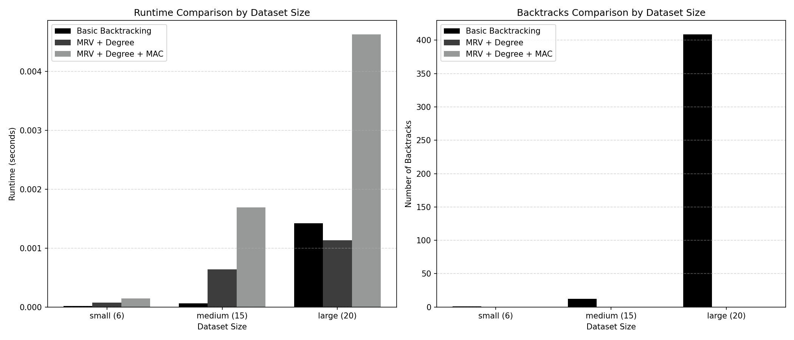
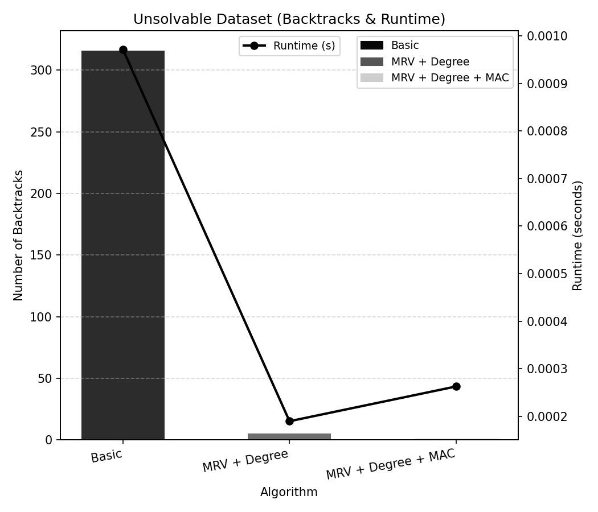

# Course Scheduler (CSP)

Builds a conflict-free class timetable as a **constraint satisfaction problem**, then measures what variable-ordering heuristics and constraint propagation actually buy you.

Each course is a variable, each of its sections is a possible value, and the solver picks **one section per course** such that no two chosen sections overlap in time. If no such complete assignment exists, it reports failure. Three solver modes are compared: plain **backtracking**, **MRV + Degree** heuristics, and **MAC (AC-3)** constraint propagation.

📄 **Full write-up:** [CSP_Report.pdf](CSP_Report.pdf) — problem formulation, algorithms, experimental setup, and analysis.

---

## Results

Four datasets: **small** (6 courses), **medium** (15), **large** (20), and an **unsolvable** instance (13 courses with no valid full assignment).





| Dataset | Mode | Runtime (s) | Nodes visited | Backtracks | Solved |
|---|---|---|---|---|---|
| small (6) | basic | 0.000017 | 7 | 1 | yes |
| small (6) | mrv_degree | 0.000072 | 6 | 0 | yes |
| small (6) | mrv_degree_mac | 0.000156 | 6 | 0 | yes |
| medium (15) | basic | 0.000067 | 27 | 12 | yes |
| medium (15) | mrv_degree | 0.000650 | 15 | 0 | yes |
| medium (15) | mrv_degree_mac | 0.001722 | 15 | 0 | yes |
| large (20) | basic | 0.001443 | 429 | 409 | yes |
| large (20) | mrv_degree | 0.001188 | 20 | 0 | yes |
| large (20) | mrv_degree_mac | 0.004846 | 20 | 0 | yes |
| unsolvable (13) | basic | 0.001637 | 316 | 316 | no |
| unsolvable (13) | mrv_degree | 0.000184 | 5 | 5 | no |
| unsolvable (13) | mrv_degree_mac | 0.000144 | 1 | 1 | no |

*(raw data: [`results.csv`](results.csv) · full analysis: [CSP_Report.pdf](CSP_Report.pdf))*

### What the numbers show

**Search effort and wall-clock time tell different stories.** On solvable instances, MRV + Degree eliminates backtracking entirely — 0 backtracks at every size — while plain backtracking degrades sharply, needing 409 backtracks and 429 visited nodes to schedule 20 courses.

**Heuristics are not free.** On the small and medium datasets, plain backtracking is still *faster in wall-clock time* despite exploring more nodes, because recomputing domain sizes and degrees each step costs more than the search it saves. MRV + Degree only overtakes plain backtracking at 20 courses (1.19 ms vs 1.44 ms) — the crossover point where search cost finally dominates bookkeeping cost.

**Propagation pays off on failure.** The unsolvable instance is where the ordering matters most: plain backtracking needs 316 backtracks to prove no schedule exists, MRV + Degree needs 5, and MAC needs just **1** — AC-3 wipes out a domain immediately and the search terminates. That is a ~11x wall-clock speedup (0.14 ms vs 1.64 ms) over plain backtracking on the same problem.

**Takeaway:** on loosely constrained, satisfiable timetables the simple solver is good enough, while heuristics plus propagation are what make tightly constrained and unsatisfiable instances tractable.

---

## Solver modes

- **`basic`** — variable order is list order; plain backtracking.
- **`mrv_degree`** — MRV (fewest feasible sections remaining) with the degree heuristic as tie-break.
- **`mrv_degree_mac`** — same ordering over explicit domains, plus `ac3` after each assignment to enforce arc consistency (MAC).

---

## Files

| File | Role |
|------|------|
| **`models.py`** | Dataclasses: `Section` (days, start, end), `Course` (id, name, credits, sections), and `Metrics` for experiments. |
| **`constraints.py`** | `time_conflict` (two sections overlap on a shared day), `not_conflicting_with_selected_sections` (new section vs current assignment). |
| **`course_data.py`** | Four datasets: `get_small_dataset()`, `get_medium_dataset()`, `get_large_dataset()`, and `get_forced_backtracking_dataset()` (unsolvable, built to stress backtracking). |
| **`solver.py`** | `Solver`: backtracking with modes — plain, MRV+degree, or combined with MAC (AC-3). |
| **`experiment.py`** | Runs all three modes across all four datasets; prints runtime, nodes visited, backtracks; writes **`results.csv`**. |
| **`visualize.py`** | Bar charts comparing runtime and backtracks across dataset sizes → `results_graph.png`. |
| **`visualize2.py`** | Backtracks and runtime on the unsolvable dataset → `unsolvable_graph.png`. |

---

## How to run

**Python 3**; only the visualization scripts need a third-party package (`matplotlib`).

```bash
git clone https://github.com/JungeuiLee/course-scheduler-csp.git
cd course-scheduler-csp
python3 experiment.py          # runs all modes on all datasets, writes results.csv
python3 visualize.py           # regenerates results_graph.png
python3 visualize2.py          # regenerates unsolvable_graph.png
```

### Using the solver directly

```python
from course_data import get_large_dataset
from solver import Solver

courses = get_large_dataset()
solver = Solver(courses, mode="mrv_degree")   # or "basic", "mrv_degree_mac"
solution = solver.solve()

print(solution)                                # {course_id: Section} or None
print(solver.metrics.nodes_visited, solver.metrics.backtracks)
```

To record wall-clock time the way `experiment.py` does, wrap `solve()` with `time.time()` and set `solver.metrics.runtime`.

---

## `solver.py` — API reference

**`__init__(self, courses, mode="basic")`** — Stores the course list and mode; initializes `Metrics()`.

| Method | Role |
|--------|------|
| **`solve(self)`** | If `mode` is `"mrv_degree_mac"`, builds per-course domain dicts and calls `backtrack_mac`. Otherwise calls `backtrack`. Returns a `{course_id: Section}` assignment on success, or `None`. |
| **`backtrack(self, assignment)`** | If every course is assigned, returns the solution. Otherwise picks an unassigned course, tries non-conflicting sections, recurses. If all branches fail, increments backtrack count and returns `None`. |
| **`backtrack_mac(self, assignment, domains)`** | MAC-style backtracking: copies domains, restricts current course to chosen section, runs `ac3`; if `ac3` fails, undoes. |
| **`choose_unassigned_course(self, assignment)`** | Dispatches to `choose_unassigned_course_basic` or `choose_unassigned_course_mrv_degree` by mode. |
| **`choose_unassigned_course_mrv_degree_mac(self, assignment, domains)`** | Among unassigned courses, picks smallest **domain size (MRV)**; ties broken by **degree**. |
| **`get_unassigned_courses(self, assignment)`** | Returns `Course` objects not yet in `assignment`. |
| **`choose_unassigned_course_basic(self, assignment)`** | Takes the **first** unassigned course (fixed order). |
| **`choose_unassigned_course_mrv_degree(self, assignment)`** | **MRV**: fewest sections still consistent with the assignment; ties broken with **degree**. |
| **`get_section_count(self, course, assignment)`** | Counts sections of `course` that do not time-conflict with any assigned section (for MRV). |
| **`get_degree(self, course, unassigned)`** | Counts other unassigned courses that can time-conflict with `course` via **some** section pair. |
| **`number_of_conflicts(self, c1, c2)`** | `True` if any section of `c1` time-conflicts with any section of `c2`. |
| **`ac3(self, domains, assignment)`** | AC-3: queue of arcs `(i,j)`, `revise` to shrink domains; returns `False` if any domain becomes empty. |
| **`revise(self, course_one, course_two, domains)`** | Removes values from `course_one`'s domain that conflict with **every** value in `course_two`'s domain. Returns whether the domain changed. |
